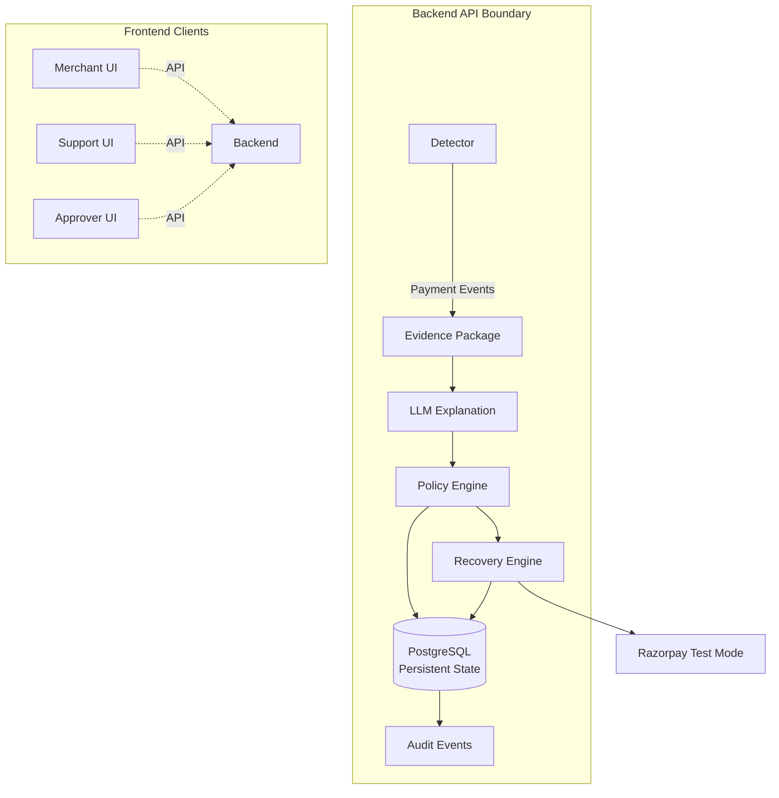

# DegradeWatch

## Overview

DegradeWatch is a **merchant-side payment incident-response system** that detects localized payment degradation, constructs deterministic evidence, uses an LLM to generate an explanation, evaluates a deterministic policy, and executes bounded recovery actions via Razorpay Test Mode.

## Problem

When payments start failing in a specific segment (for example UPI + Bank X + Android), merchants often only see a vague drop in success rate. They don’t know where the problem is concentrated, how much revenue is at risk, or what is safe to do next.

DegradeWatch turns that ambiguity into a clear, evidence-backed incident report and a bounded recovery decision that both the merchant and Razorpay support can trust.

> **Architecture Principle:**  
> Probabilistic systems may explain an incident; they do not decide whether a money-moving action is permitted.  
>  
> The LLM is **only an explanatory layer**. All enforcement decisions are made by the deterministic `PolicyEngine`. Evidence collected deterministically by the backend is the authoritative source of truth.

## End-to-End Architecture & Ownership Boundaries

DegradeWatch relies on strictly enforced ownership boundaries. Each component is responsible for a specific phase of the incident response lifecycle:

* **Detector** → Owns **incident classification** (Normal vs. Incident) based on anomaly detection.
* **EvidencePackageBuilder** → Owns **deterministic evidence**. It aggregates baseline data, success rates, latency, and revenue-at-risk into a persisted deterministic evidence package.
* **LLMReportGenerator** → Owns **explanation/forensic interpretation only**. It reads the evidence and provides a human-readable hypothesis, but its outputs cannot override backend-owned facts.
* **PolicyEngine** → Owns the **deterministic authorization decision** (`AUTO_APPROVED`, `HUMAN_APPROVAL`, `BLOCKED`).
* **RecoveryEngine** → Owns execution of an already-authorized recovery action and its persisted recovery state.
* **PostgreSQL** → Owns **persistent system state** (merchants, incidents, evidence, decisions, recovery state, and audit logs).
* **AuditEvent** → Owns the **traceability of important decisions and state transitions**.
* **Frontend** → Owns **presentation and API interaction; never the security boundary**.



## Demo Flow

1. Normal payment traffic is flowing.
2. A localized degradation is introduced (e.g. UPI + BANK_X + Android).
3. Detector raises an incident.
4. EvidencePackageBuilder constructs deterministic evidence (including estimated revenue at risk).
5. LLM generates a forensic explanation from that evidence.
6. PolicyEngine decides: AUTO_APPROVED / HUMAN_APPROVAL / BLOCKED.
7. If approved, RecoveryEngine executes a bounded recovery action via Razorpay Test Mode.
8. Full audit trail is recorded.

## Recovery Request: End to End

For an incident eligible for recovery:

1. Detector classifies the payment degradation.
2. EvidencePackageBuilder constructs deterministic evidence from backend-owned data.
3. LLMReportGenerator produces an explanation from that evidence.
4. PolicyEngine evaluates the evidence and report against deterministic safety rules.
5. If BLOCKED, execution stops.
6. If HUMAN_APPROVAL, an authorized approver must explicitly approve.
7. If AUTO_APPROVED, RecoveryEngine creates the bounded recovery record.
8. PostgreSQL enforces persistence and idempotency.
9. RecoveryEngine executes the authorized Razorpay Test Mode action.
10. The resulting state transition is persisted and audited.

At no point does the frontend, LLM, or Razorpay response determine whether the recovery was authorized.

## Safety Mechanisms

DegradeWatch is built to prevent unsafe automated recovery. The system uses three distinct states for any recovery action:

- **BLOCKED**: Hard safety violations prevent any recovery. Triggered by customer-caused incidents, unsupported actions, insufficient baseline samples, or contradictory evidence.
- **HUMAN_APPROVAL**: The policy passes all automated safety checks, but uncertainty remains (e.g., LLM confidence is low, or the incident is multi-dimensional). Requires an approver to explicitly authorize recovery.
- **AUTO_APPROVED**: All deterministic checks pass and the policy’s configured confidence requirement is satisfied.

### Explicit Safety Guarantees

- **Customer-Caused Incident Protection**: If the `error_evidence` indicates the incident is primarily customer-caused, the policy evaluates to BLOCKED. DegradeWatch will never auto-recover user-error cases.
- **Revenue-at-Risk Validation**: The recovery amount cannot exceed the merchant's mathematically calculated `revenue_at_risk` or the configured hard limit (1,000,000 paise / ₹10,000). Any request exceeding this limit is blocked.
- **Idempotency & Concurrency**: Database-backed idempotency prevents duplicate recovery records and concurrent duplicate execution. Records are keyed uniquely by (`incident_id`, `action_type`) and an `idempotency_key`. The `RecoveryEngine` relies on PostgreSQL for consistency rather than in-memory locks.
- **Razorpay Test Mode**: All API integrations target Razorpay's Test Mode environment. No real funds are moved.
- **Simulation Mode Behavior**: If `SIMULATION_MODE=true` is set and Razorpay credentials are missing, the system falls back to generating deterministic mock payment links (`plink_sim_<hash>`), allowing end-to-end evaluation without an active Razorpay client.

## Authentication and Authorization

Security is enforced strictly on the backend. The frontend is a presentation layer, not a security boundary.

- **JWT-Based Authentication**: Requests must present a valid JWT. The backend uses the `sub` claim to reliably establish the authenticated identity.
- **Merchant Isolation**: The backend derives the authorization context (`merchant_id`) from the authenticated user. All database queries and API actions are aggressively scoped to the resolved `merchant_id`. Merchant users cannot access or interact with another merchant's resources.
- **RBAC (Role-Based Access Control)**: Actions like approving a HUMAN_APPROVAL recovery require the appropriate backend role (e.g., `approver`). This is verified via a FastAPI dependency before execution.

## API Surface

The backend exposes three operational surfaces:

| Surface | Purpose |
| --- | --- |
| `/api/merchant/*` | Merchant-scoped incident and recovery visibility |
| `/api/support/*` | Incident investigation, evidence, and audit inspection |
| `/api/approvals/*` | Authorized human approval/rejection of recoveries |

All authorization is enforced server-side. The frontend only invokes operations permitted by the authenticated user's role and merchant scope.

Interactive API documentation is available at:
- `/docs` — Swagger UI
- `/redoc` — ReDoc

## Persistence Domain Model

The source of truth for the entire system lives in PostgreSQL. Recovery state survives process restarts and is never dependent on in-memory state.
The schema includes the following primary entities:

- **Merchant**: Tenant isolation.
- **User**: Hashed credentials and roles.
- **Incident**: Base incident metadata.
- **EvidencePackage**: JSON blob containing the deterministic evidence.
- **ForensicReport**: The LLM's explanation.
- **PolicyDecision**: The outcome of the Policy Engine.
- **Recovery**: The recovery execution record and idempotency payload.
- **AuditEvent**: Append-only traceability log.

## Failure Handling

- **Missing/Invalid Razorpay Credentials**: If credentials are missing, the system fails to initialize the Razorpay client. If `SIMULATION_MODE=true`, it safely degrades to deterministic mock payloads. If false, it fails the recovery loudly.
- **Razorpay API Failure/Timeouts**: Handled as execution failures. The Recovery record is marked accordingly, and an `AuditEvent` is logged. Database-backed idempotency ensures safe retries.
- **Duplicate Recovery Requests**: The `RecoveryEngine` checks persisted recovery state before executing an action and returns an existing authoritative record when the action has already been processed.
- **Invalid Recovery Amounts**: The backend strictly validates the requested amount against the internal `revenue_at_risk`. Violations are immediately blocked.
- **Unauthorized Attempts**: Attempting to execute a recovery action for an incident in a BLOCKED or unapproved HUMAN_APPROVAL state throws an authorization exception.

## Testing

> **136 passed, 0 failed**

The system is rigorously tested across the following major categories:

- **Detector/Scenario Evaluation**: Verification of classification logic.
- **Evidence Generation**: Ensuring determinism in the evidence payload.
- **Policy Decisions**: Comprehensive matrix testing of BLOCKED, HUMAN_APPROVAL, and AUTO_APPROVED pathways.
- **Recovery Engine**: Simulation fallback, amount validation, and test-mode API integration.
- **Concurrency/Idempotency**: Parallel execution safety using database constraints.
- **Authentication & Merchant Isolation**: Cross-tenant data access attempts, authorization bypass attempts, and role enforcement.
- **Persistence**: Alembic migration and ORM validation.

### Known Findings

- **Scenario A Policy Boundary**: The system conservatively falls back to HUMAN_APPROVAL rather than executing an uncertain recovery when LLM confidence lands exactly on the policy threshold. This is an intentional safety outcome, prioritizing human review over automated risk.

## Current Status

DegradeWatch is a production-oriented prototype validated against Razorpay Test Mode. It prioritizes safety, auditability, and deterministic control over money-moving actions.

While not suitable for real-money production payment processing, the architecture has been hardened for authentication, tenant isolation, persistent recovery state, database-backed idempotency, concurrency safety, bounded recovery limits, explicit failure handling, API safety, and auditability.

## Important Engineering Decisions

- **Deterministic evidence before LLM reasoning**: The LLM does not query logs or make calculations. It is fed a strictly validated package.
- **LLM cannot override backend-owned facts**: Factors like `revenue_at_risk` and `customer_error_rate_change` are untouchable by the LLM.
- **Policy engine is separate from recovery execution**: The authorization to recover is decoupled from the execution mechanism.
- **PostgreSQL is the source of truth for recovery state**: Concurrency safety relies on database transactions and constraints, not brittle in-memory locks.
- **Backend authorization rather than frontend authorization**: The UI is purely presentational. The backend derives its own context.
- **Explicit simulation mode**: Bounded behavior exists to handle network or credential absence deterministically.
- **Append-only audit trail**: Significant recovery, policy, approval, and lifecycle state transitions generate `AuditEvent` records.

## Local Setup & Development

### Prerequisites

- Python 3.10+
- Node.js 18+
- Docker (for PostgreSQL)

### 1. Environment Variables

Create `.env` in the repository root:
```bash
# Security & JWT
JWT_SECRET_KEY=super-secret-dev
JWT_ACCESS_TOKEN_EXPIRE_MINUTES=30

# External Integrations
SIMULATION_MODE=true
MAXIMUM_RECOVERY_PAISA=1000000

# LLM Forensic Generation (Required)
# Get your free API key at: https://console.groq.com/keys
GROQ_API_KEY=your_groq_api_key_here

# Razorpay Test Mode (Optional)
# If omitted and SIMULATION_MODE=true, the system will automatically 
# generate deterministic mock payment links (plink_sim_xxx) instead.
# RAZORPAY_KEY_ID=rzp_test_yourkey
# RAZORPAY_KEY_SECRET=yoursecret
```
### Deployment via Docker

DegradeWatch is fully containerized and can be launched with a single command. This will spin up the PostgreSQL database, the FastAPI backend, and the Vite/React frontend.

```bash
# Build and start all services in detached mode
docker compose up -d --build

# Once running, seed the database with demo scenarios
docker compose exec backend python scripts/seed_demo.py
```

- **Frontend UI:** [http://localhost:3000](http://localhost:3000)
- **Backend API Docs:** [http://localhost:8000/docs](http://localhost:8000/docs)

### 2. Infrastructure & Environment Setup

```bash
# Set up Python virtual environment
python -m venv venv
source venv/bin/activate
pip install -r backend/requirements.txt

# Start PostgreSQL
docker compose up -d postgres

# Run Alembic migrations
alembic -c backend/alembic.ini upgrade head
```

### 3. Backend & Data Setup

```bash
# Seed demo data
python scripts/seed_demo.py

# Run the API
uvicorn backend.app.main:app --reload
```

### 4. Frontend Setup

```bash
cd frontend
npm install
npm run dev
```

### 5. Test Execution

```bash
pytest
```

## Repository Tree

```text
backend/
  app/
    models/
    policy_engine.py
    recovery_engine.py
    auth.py
    ...
  migrations/

frontend/
  src/
    api/
    components/
    pages/

scripts/
tests/
```

**Made by Prajwal Navada G P**
